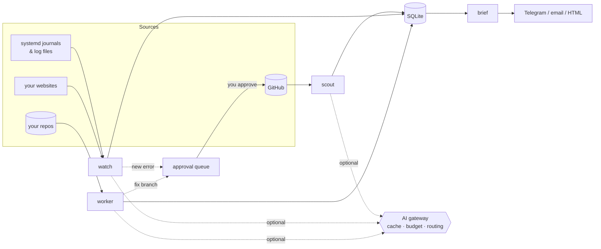

# nightops

**A self-hosted night shift for your projects.** nightops watches your
servers, checks your repositories, finds open-source issues worth your time,
and hands you a single report every morning.

Its one rule: **anything plain code can do is done without AI.** AI is off by
default. When you turn it on, it is used only for the few jobs code can't do,
through a gateway that caches, budgets, and routes every call to save tokens.

```
07:00  nightops briefing
       Sites        packages: UP (200, 184 ms)
       Errors       NEW in europass-cv x3: KeyError: 'name'
       Your repos   europass-cv-app: tests pass, 4 TODO/FIXME, 2 outdated pins
       Approvals    #3 [open_issue] File issue for new error in europass-cv
       Open source  a/b#123 score 55: Fix wrong type hint in pagination helper
```

---

## Contents

- [Features](#features)
- [How it works](#how-it-works)
- [Safety model](#safety-model)
- [Quick start](#quick-start)
- [Commands](#commands)
- [Modules in detail](#modules-in-detail)
- [The AI gateway](#the-ai-gateway)
- [Configuration reference](#configuration-reference)
- [Data storage](#data-storage)
- [Project structure](#project-structure)
- [Testing](#testing)
- [Limitations](#limitations)
- [FAQ](#faq)
- [Credits](#credits)

---

## Features

| Module | Schedule | Without AI | With AI (optional) |
|---|---|---|---|
| **scout** | every 30 min | Searches GitHub for `good first issue` / `help wanted` issues and drops anything assigned, linked to an open PR, claimed in the comments, research-sized, or in an inactive repo. Scores the rest against your skills. | Reads the top few threads and estimates difficulty, spots claims the phrase list missed, and flags fixes that probably belong upstream. |
| **watch** | every 5 min | Reads systemd journals and log files incrementally, groups Python tracebacks into single events, deduplicates errors by fingerprint, checks that your sites respond, and alerts on new errors and up/down changes. | Explains the likely root cause of **new** errors only, capped per run. |
| **worker** | 01:30 IST nightly | Updates a clone of each of your repos, runs your tests and linter, counts TODO/FIXME comments, and compares pinned requirements against PyPI. | Attempts fixes for issues **you** label, on a separate branch, and queues a draft PR once your tests pass. |
| **brief** | 07:00 IST daily | Writes a Markdown and HTML report and sends it by Telegram or email. | Not used. |
| **actions** | on demand | An approval queue. Nothing is created on GitHub until you approve it. | Not used. |

---

## How it works



Each module is a short, independent run triggered by a systemd timer. They
share one SQLite database, so the briefing can summarise everything that
happened since the previous one. A module that fails never stops the others,
and a lock file prevents two copies of the same module running at once.

---

## Safety model

These rules are enforced in code, not just documented:

- **Writes are limited to your repos.** nightops only creates issues, opens
  PRs, or pushes branches in repositories listed under `github.own_repos`.
  Everything else it touches is read-only.
- **Nothing is created without approval.** Proposed issues and pull requests
  wait in a queue until you run `actions approve <id>`.
- **The default branch is never modified.** Fixes go to `nightops/issue-N`
  branches. nightops never merges.
- **Fixes must pass your tests.** If the test command fails, the branch is not
  pushed.
- **Protected paths are refused.** Changes touching `.github/workflows/`,
  `.env`, or anything named `secrets` are discarded.
- **watch is read-only.** It never restarts, stops, or reconfigures services.
- **Secrets are redacted.** Tokens are masked in every log line and error
  message.
- **The dashboard is local and read-only.** It binds to `127.0.0.1` and has
  no approval buttons.

---

## Quick start

Requires Python 3.10+ and git.

```bash
git clone <this repo> nightops && cd nightops
python3 -m venv venv
venv/bin/pip install -r requirements.txt       # Windows: venv\Scripts\pip

cp .env.example .env                           # add GITHUB_TOKEN
venv/bin/python -m unittest discover -s tests  # offline, no token needed
venv/bin/python nightops.py doctor

venv/bin/python nightops.py run scout
venv/bin/python nightops.py run brief          # report appears in briefings/
```

For server installation, systemd timers, Telegram setup, and enabling AI, see
**[SETUP.md](SETUP.md)**.

### GitHub token

Create a **fine-grained** token with *Only select repositories* set to your own
repos and these repository permissions:

| Permission | Access | Used for |
|---|---|---|
| Contents | Read and write | pushing `nightops/*` branches |
| Issues | Read and write | filing issues you approve |
| Pull requests | Read and write | opening draft PRs you approve |

Fine-grained tokens can always read public repositories, so the same token
also serves scout. If you only use scout and watch, a read-only token is
enough.

---

## Commands

```
python nightops.py run scout|watch|worker|brief|all   run one module (or all)
python nightops.py actions list                       show pending approvals
python nightops.py actions approve <id>               execute an action
python nightops.py actions reject <id>                discard an action
python nightops.py status                             counts and AI spend
python nightops.py doctor                             check configuration
python nightops.py notify-test                        send a test notification
python serve.py                                       read-only dashboard on :8800
```

`run` exits with code 1 if any module failed, which systemd records as a
failed run.

---

## Modules in detail

### scout

Builds one GitHub search per entry in `scout.searches`, always including
`is:open no:assignee -linked:pr archived:false` and an `updated:` window.
Multiple labels in one search are combined with OR.

Every result then goes through these checks:

| Check | Result |
|---|---|
| Assigned to anyone | dropped |
| Title contains a `title_blocklist` word (benchmark, research, gsoc, ...) | dropped |
| Repo archived, disabled, or not pushed within `max_repo_idle_days` | dropped |
| An **open** pull request cross-references the issue | dropped |
| A comment contains a `claim_phrases` entry ("I'd like to take this") | heavy score penalty |

Search's `-linked:pr` only catches PRs formally linked to the issue. The
timeline cross-reference check also catches PRs that merely mention it.

Survivors are scored: points for matched `skill_keywords`, recent activity, a
`help wanted` label, a `CONTRIBUTING.md`, and evidence that the repo merges
pull requests from non-members. Penalties apply for claims and thin
descriptions.

**With AI:** the top `ai_triage_top_n` untriaged candidates are sent (title,
body, last comments) to the cheap model, which returns difficulty, whether it
looks claimed, and whether the fix likely lives upstream. Scores are adjusted
and the one-line reason is stored. Each issue is triaged only once.

### watch

1. **Collect.** For each `journal_units` entry, runs
   `journalctl -u <unit> --since @<last run>`. For each `log_files` entry,
   reads only the bytes added since the last run (handles rotation). On the
   first run it looks back `first_run_lookback_minutes`, or reads the last
   64 KB of a file.
2. **Group.** A Python traceback, from `Traceback (most recent call last)` to
   the exception line, becomes a single event. Other lines become events if
   they match `error_patterns` and not `ignore_patterns`.
3. **Fingerprint.** Tracebacks are keyed on exception type plus the last
   three frames. Single lines are normalised (numbers, hex, UUIDs, and quoted
   values replaced) so that `user 123 failed` and `user 987 failed` count as
   the same error.
4. **Deduplicate.** A known fingerprint only increments its counter. A new
   one is stored, optionally explained by AI, and, if its source appears in
   `issue_repo_map`, turned into a proposed GitHub issue.
5. **Health checks.** Each URL is requested; status and latency are
   recorded. Alerts fire only on state changes (up → down, down → up).

New errors and state changes are sent immediately when
`notify.alert_immediately` is true.

### worker

For each entry in `worker.repos` that is also in `github.own_repos`:

1. Clone into `workdir`, or fetch and hard-reset to `origin/<default_branch>`.
   This is a separate copy; your deployed app is never touched.
2. Run `setup_command`, `test_command`, and `lint_command` if set.
3. Count `TODO`, `FIXME`, `XXX`, `HACK` in tracked text files.
4. Compare `==` pins in `requirements.txt`, `requirements-prod.txt`, or
   `requirements/base.txt` against the latest PyPI release (first 40 pins).

**AI fixes** (`ai_fix.mode`) run for open issues carrying `issue_label`, up to
`max_issues_per_night`, skipping issues already pushed:

| Mode | What happens |
|---|---|
| `"off"` | No fix attempts (default). |
| `builtin` | Picks up to `max_files` relevant files (paths mentioned in the issue, then files matching title keywords), makes one strong-model call through the gateway, and applies the returned unified diff. |
| `command` | Runs `agent_command` in the clone with the issue as the prompt on stdin. Use this with a coding agent CLI such as Claude Code. It uses that tool's own login and billing. |

Either way, the result goes through the same gates: changes must exist, must
not touch protected paths, and must pass `test_command`. Only then is the
branch committed, pushed, and a draft PR queued for approval. Every attempt,
successful or not, is logged and appears in the next briefing.

### brief

Summarises everything since the previous briefing (or the last 24 hours):
latest site status, new and recurring errors with any AI explanation, the
latest repo checks, night work, pending approvals, the best new scout finds,
and today's AI usage. Writes `briefings/<date>_<time>.md` and `.html`, and
sends a plain-text version through the configured channels (Telegram
messages are truncated at about 3,900 characters).

### actions

The approval queue. Each action has a kind (`open_issue`, `open_pr`), a target
repo, a payload, and a dedupe key so the same proposal is never queued twice.
`approve` re-checks the repo against `own_repos` before calling GitHub, then
records the resulting URL or the error.

---

## The AI gateway

All AI traffic passes through `core/ai.py`.

| Feature | Behaviour |
|---|---|
| Off by default | `ask()` returns `None` when disabled, the key is missing, the budget is spent, or the call fails. Every caller has a non-AI fallback. |
| Cache | Responses are keyed by provider, model, system prompt, prompt, and token limit. Cache hits are free and recorded as such. |
| Daily budget | Before each call, today's usage plus an estimate is compared with `daily_token_budget`. Over budget means skip. |
| Routing | `cheap_model` for classification and explanations, `strong_model` only for code fixes. |
| Compression | Inputs over `max_input_chars` keep their first 70% and the end, with a marker in between. |
| Providers | `openai_compatible` (Groq, OpenAI, OpenRouter, local Ollama) and `anthropic` (Claude API). |

Where AI is used, and how much:

| Purpose | Model | When | Cap |
|---|---|---|---|
| `scout_triage` | cheap | new top candidates only | `ai_triage_top_n` per run, ~200 output tokens |
| `watch_root_cause` | cheap | new error fingerprints only | `max_ai_per_run` per run, ~350 output tokens |
| `worker_fix` | strong | labelled issues, builtin mode | `max_issues_per_night`, `max_output_tokens` |

`python nightops.py status` shows today's spend and cache hits.

---

## Configuration reference

All settings live in `config.yaml`. Secrets live in `.env` and are referenced
by variable name.

### `storage`, `github`

| Key | Default | Meaning |
|---|---|---|
| `storage.db_path` | `nightops.db` | SQLite file |
| `github.token_env` | `GITHUB_TOKEN` | env var holding the token |
| `github.own_repos` | — | the only repos nightops may write to |

### `ai`

| Key | Default | Meaning |
|---|---|---|
| `enabled` | `false` | master switch |
| `provider` | `openai_compatible` | or `anthropic` |
| `base_url` | Groq endpoint | for `openai_compatible` |
| `api_key_env` | `AI_API_KEY` | env var holding the key (not needed for localhost) |
| `cheap_model` / `strong_model` | Groq Llama models | model names for your provider |
| `daily_token_budget` | `200000` | input + output tokens per UTC day |
| `max_input_chars` | `12000` | compression limit for prompts |
| `cache` | `true` | reuse identical responses |

### `notify`

| Key | Meaning |
|---|---|
| `channels` | list containing `telegram` and/or `email` |
| `alert_immediately` | send watch alerts as they happen |
| `telegram.bot_token_env`, `telegram.chat_id_env` | env var names |
| `email.smtp_host`, `smtp_port`, `user_env`, `password_env`, `to` | SMTP with STARTTLS |

### `scout`

| Key | Meaning |
|---|---|
| `searches` | list of `{language, issue_labels, keywords}` |
| `updated_within_days` | ignore issues older than this |
| `skill_keywords` | terms that raise the score |
| `disqualify.assigned`, `disqualify.open_linked_pr` | hard filters |
| `title_blocklist` | words that mark research or epic-sized work |
| `claim_phrases` | comment phrases that indicate someone took the issue |
| `health.max_repo_idle_days`, `check_external_prs`, `external_pr_sample` | repo health checks |
| `scoring.*` | point values for each signal |
| `ai_triage`, `ai_triage_top_n` | optional AI pass |

### `watch`

| Key | Meaning |
|---|---|
| `journal_units` | systemd unit names to read |
| `log_files` | absolute paths to plain log files (e.g. pm2 logs) |
| `first_run_lookback_minutes` | how far back the first run reads journals |
| `error_patterns`, `ignore_patterns` | regular expressions |
| `health_checks` | list of `{name, url, expect_status, timeout}` |
| `issue_repo_map` | `{source: owner/repo}` for proposing issues on new errors |
| `ai_root_cause`, `max_ai_per_run` | optional AI explanations |

### `worker`

| Key | Meaning |
|---|---|
| `workdir` | where clones are kept |
| `repos[].repo` | `owner/name`, must also be in `own_repos` |
| `repos[].default_branch` | usually `main` |
| `repos[].setup_command` | e.g. create a venv and install requirements |
| `repos[].test_command` | must exit 0 for a fix to be pushed |
| `repos[].lint_command` | optional |
| `repos[].issue_label` | label that opts an issue into AI fixes |
| `ai_fix.mode` | `"off"`, `builtin`, or `command` (keep quotes on `"off"`) |
| `ai_fix.max_issues_per_night`, `max_files`, `max_context_chars`, `max_output_tokens` | limits for builtin mode |
| `ai_fix.agent_command`, `agent_timeout` | for command mode |

### `briefing`

| Key | Meaning |
|---|---|
| `output_dir` | where reports are written |

Every module also accepts `enabled: false`.

---

## Data storage

One SQLite file (`nightops.db`):

| Table | Contents |
|---|---|
| `scout_issues` | vetted issues, score, reasons, AI note, first/last seen |
| `errors` | fingerprint, source, sample, count, first/last seen, AI summary |
| `health` | every health check result |
| `repo_checks` | nightly check results per repo (JSON) |
| `work_log` | every fix attempt and its outcome |
| `actions` | the approval queue |
| `ai_cache`, `ai_usage` | cached responses and per-call token accounting |
| `kv` | cursors (last journal read, file offsets, last briefing) |

Delete the file to start fresh; it is recreated automatically.

---

## Project structure

```
nightops/
├── nightops.py            CLI entry point
├── config.yaml            all settings
├── serve.py               read-only dashboard
├── core/
│   ├── ai.py              AI gateway
│   ├── config.py          config and .env loading
│   ├── github.py          GitHub REST client (rate-limit aware)
│   ├── notify.py          Telegram and email
│   ├── store.py           SQLite
│   └── util.py            time, logging with redaction, locks, shell runner
├── modules/
│   ├── scout.py
│   ├── watch.py
│   ├── worker.py
│   ├── briefing.py
│   └── actions.py         approval queue
├── systemd/
│   ├── nightops@.service  one template for all modules
│   └── nightops-{watch,scout,worker,brief}.timer
├── tests/test_nightops.py
├── README.md
└── SETUP.md
```

Adding a module means writing a `run(cfg, store, gh, ai)` function in
`modules/`, registering it in `MODULES` in `nightops.py`, and adding a timer.

---

## Testing

```bash
python -m unittest discover -s tests -v
```

18 offline tests, using fake GitHub and fake AI transports. They cover the AI
gateway (disabled path, cache, budget, routing, compression), scout filters
and an end-to-end run, traceback grouping and fingerprinting, error
deduplication and issue proposal, requirement parsing, diff extraction, the
worker's off mode, the approval queue's repo check and deduplication,
briefing rendering, and secret redaction. One test requires `git`.

---

## Limitations

- **Claim detection without AI is phrase matching.** Unusual wording or other
  languages can slip through. AI triage helps but only for the top few.
- **scout depends on labels.** Unlabelled issues are invisible to it.
- **The builtin fixer is one AI call.** It suits small, well-described issues.
  For larger work use `command` mode with a real coding agent.
- **AI fixes are only as safe as your tests.** A repo without tests gives no
  verification; keep `ai_fix` off there.
- **journal reading is Linux-only.** On Windows, watch can still read log
  files and run health checks.
- **Outdated-package checks only read `==` pins** in the listed requirements
  files.
- **Single host.** SQLite and file locks assume one machine.

---

## FAQ

**Does it need AI at all?**
No. With AI off, scout, watch, worker checks, briefings, alerts, and the
approval queue all work.

**Will it open pull requests on other people's projects?**
No. Writes are restricted to `own_repos`, and even there every issue and PR
waits for your approval. scout only reads.

**What does it cost to run?**
Without AI: nothing beyond the server. With AI: at most `daily_token_budget`
tokens per day, usually far less because of caching and the per-run caps.

**Can it restart a crashed service?**
No, by design. watch reports; you decide.

**Can I run it without systemd?**
Yes. Use cron (`*/5 * * * * cd /opt/nightops && venv/bin/python nightops.py run watch`)
or run `python nightops.py run all` manually.

---

## Credits

nightops brings together ideas from several open-source "nightshift"
projects: an agent-driven issue worker (Shaurya-Sethi/nightshift), an
on-call error triager (ranjan98/nightshift), an overnight assistant with a
morning briefing and approval queue (DragonSenseiGuy/nightshift), and a
token-saving runtime for AI agents (oneKn8/nightshift). The code here is an
independent implementation.

## License

apache
